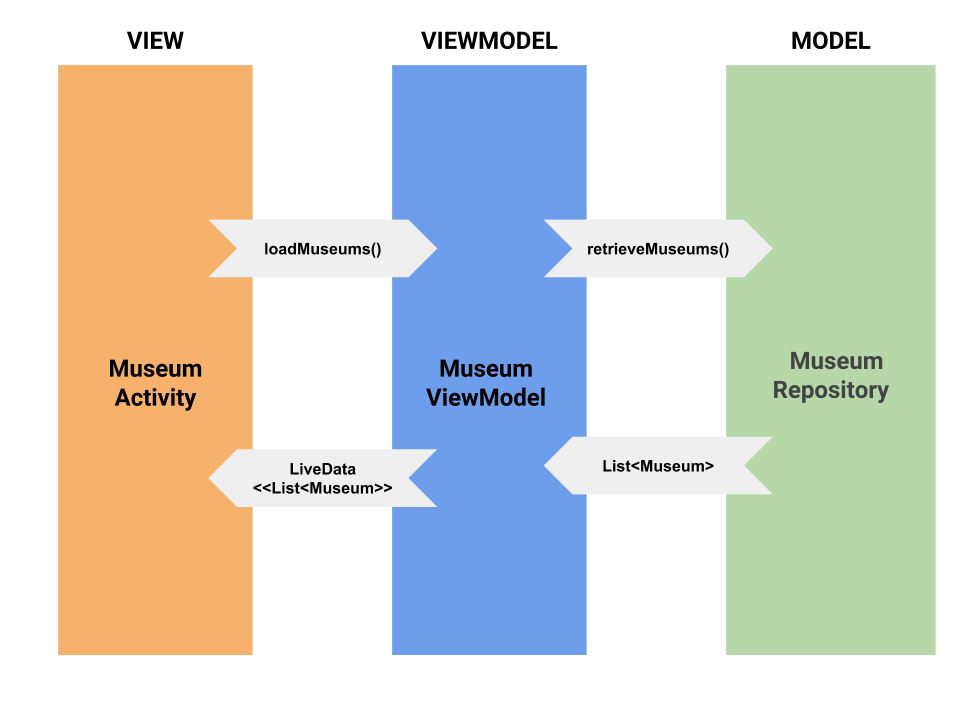

# flutter_app_mvvm

A new sample Flutter MVVM application.

### MVVM Pattern (Model View ViewModel)
 

### Architecture

### Flow

 

### Slides

Android MVVM https://docs.google.com/presentation/d/1nTwtU8OWYs_8Q3i_3hOPAWodDpDKzO--uA-4b6LUr8g/edit?usp=sharing

Android MVVM Clean https://docs.google.com/presentation/d/1luTzvqGaMjVycEx109-AjYIj3FIpXYAt3Mnu-gjqxtc/edit?usp=sharing

### Dependencies

 cupertino_icons: ^1.0.0
  avatar_glow: 1.2.0
  route_annotation: ^0.2.0
  http: ^0.12.0+2
  provider: ^3.2.0

### References

https://flutter.dev/docs/get-started/flutter-for/android-devs

### Contributing and reporting issues

You can to contribute in this repository. 

I appreciate any question or comment. Also, if you consider it useful, you can give me a star ⭐ ⭐ ⭐ ⭐ ⭐.
